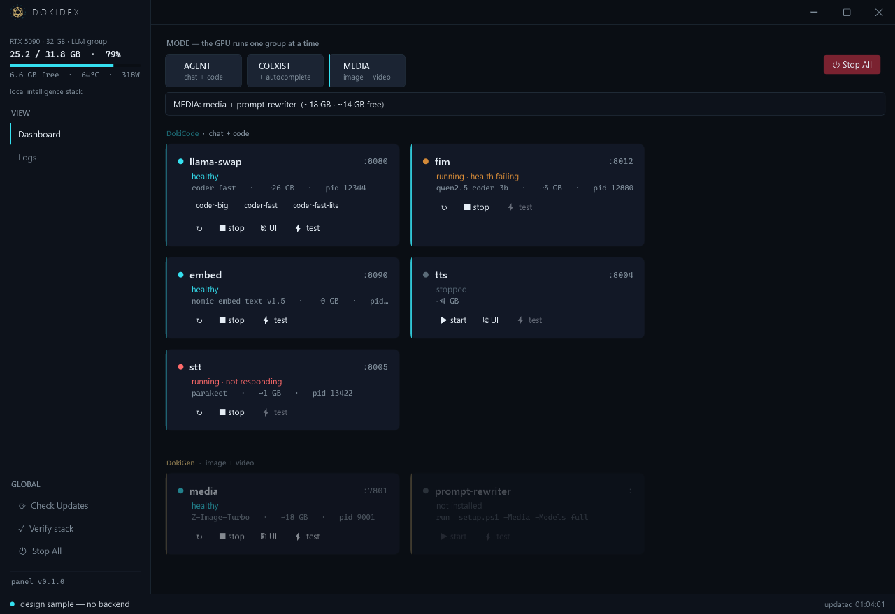

# DokiDex

Fully-local AI agentic coding infrastructure — a Claude Code / Codex / Copilot-class setup that runs entirely on my own hardware (RTX 5090 / 32GB VRAM, 64GB DDR5, Windows 11). No cloud AI services at runtime; web search allowed.

<p align="center">
  
  <br><sub>The DokiDex control panel — one GPU group at a time, live RTX 5090 meter, per-service health (healthy / warming / stopped / crashed / not-installed), and one-click coder-model hot-swap.</sub>
</p>

**▶ Features (full index):** [docs/FEATURES.md](docs/FEATURES.md) · **How it all works (architecture):** [docs/how-it-works.md](docs/how-it-works.md) · **Design doc:** [docs/TDD.md](docs/TDD.md) · **ELI5 explainer:** [docs/wiki/Home.md](docs/wiki/Home.md) · **API recipes:** [docs/media-recipes.md](docs/media-recipes.md)

## Run it

```powershell
.\setup.ps1            # one-time: prereqs + deploy configs (chat/code)
.\setup.ps1 -Media -Models full   # image+video+music+edit quality kit (SwarmUI + models, headless)
.\setup.ps1 -Tts       #   ...plus uncensored speech/TTS (Chatterbox + voice cloning, :8004)
.\setup.ps1 -Stt       #   ...plus local speech-to-text (Parakeet via onnx-asr, :8005)

.\doki.ps1 up          # chat + code + speech in/out → llama-swap :8080 + TTS :8004 + STT :8005
.\doki.ps1 up coexist  #   + autocomplete → FIM on :8012
.\doki.ps1 up media    # image + video + music + image-edit → SwarmUI on :7801
.\doki.ps1 gen "a neon koi dragon"        # text→media (also -Video / -Music / -Edit / -Fast) — needs `up media`
.\doki.ps1 status      # what's running + health      .\doki.ps1 down
.\doki.ps1 verify      # full-stack smoke test — cycles all modes, checks every capability
.\doki.ps1 doctor      # environment + install diagnostics (GPU, disk, toolchain, models, services)
.\doki.ps1 test        # unit tests — installer helpers + control panel + updater (fast, no GPU)
.\doki.ps1 panel       # high-quality control panel (WPF): cinematic boot, live status, GPU meter, logs, ⚡test
.\control.bat          #   ...first run: builds + creates a console-free DokiDex.lnk launcher (arc-reactor icon)
```

After the first `control.bat`, just double-click **`DokiDex.lnk`** — no console window; it plays the
boot sequence ("THE SEAL IGNITES") and opens the panel, which **auto-updates itself** from GitHub
releases. Cut a release with `git tag vX.Y.Z && git push origin vX.Y.Z` (builds a self-contained exe).

GPU modes are mutually exclusive on 32GB, so `doki` switches between the LLM and the image/video server. The three things you launch yourself: the CLI (**Crush**), the chat app (**Chatbox**), and the editor (**llama.vscode**).

## Layout

| Path | Purpose |
|---|---|
| `doki.ps1` | Native control plane — start/stop/status the stack (no Docker) |
| `setup.ps1` | One-command bootstrap (prereqs, config deploy, `-Media` = SwarmUI + models) |
| `docs/` | Design doc, decision log, benchmarks, ELI5 wiki |
| `serving/` | llama.cpp / llama-swap configs and launch scripts |
| `harness/` | Crush / OpenCode / llama.vscode configs, AGENTS.md template |
| `evals/` | Golden-task eval suite, runner, scorecards |
| `media/` | SwarmUI + ComfyUI + image/video model weights — git-ignored |
| `media-assets/` | Committed ComfyUI custom workflows (`WanFoley.json`) + the DokiGen SwarmUI theme — tracked |
| `models/` | GGUF weights — git-ignored, local only |

## Stack at a glance

- **Inference:** llama.cpp `llama-server` (native Windows CUDA) behind **llama-swap** (one OpenAI-compatible endpoint, multiple models)
- **Models:** ~30B coder MoE fully on GPU (fast daily driver) + ~120B sparse MoE with CPU-offloaded experts (heavy hitter)
- **Code:** Crush (daily driver, bake-off winner) — OpenCode / Claw Code challengers
- **Chat:** Chatbox → local endpoint · **Autocomplete:** small FIM model + llama.vscode
- **Search + memory:** keyless DuckDuckGo MCP · a local **persistent-memory MCP** (sqlite FTS5) the coder can save facts/decisions to and recall across sessions
- **Image + video + audio:** SwarmUI (ComfyUI) — Z-Image Turbo/Base + Wan 2.2 (5B) text-to-video **and image-to-video** with synced Foley audio; **music** (ACE-Step 1.5), **instruction image-editing** (Qwen-Image-Edit), **4×-UltraSharp upscaling** — all unfiltered, headless. SwarmUI wears the matching on-brand **DokiGen Void** theme (default, set at install). A 3B prompt-rewriter auto-expands lazy prompts (`<mpprompt:…>`)
- **Speech (TTS):** Chatterbox on `:8004` — uncensored (watermark stripped), OpenAI `/v1/audio/speech` + zero-shot voice cloning; coexists with the coder LLM
- **Speech-to-text (STT):** Parakeet (onnx-asr) on `:8005` — OpenAI `/v1/audio/transcriptions`, CPU EP, coexists with the coder
- **Control panel:** a native WPF cockpit (`doki panel`) over `doki status json` — grouped live service cards, GPU trust-meter, mode switcher with 32 GB-headroom + eviction confirm, live logs, per-modality ⚡test

## Status

**Complete and verified across the board (2026-06-14)** — fully local, one command to run:

- **Inference:** llama-swap `:8080` — `coder-fast` (265 tok/s), `coder-big`, `coder-fast-lite`; clean native tool calls.
- **Code:** Crush v0.76, **91%** on the 11-task golden suite (`docs/scorecards/`). Claw Code bake-off'd → rejected (45%, flaky tool calls).
- **Chat:** Chatbox → `:8080`. **Autocomplete:** Qwen2.5-Coder-3B FIM on `:8012` (live `/infill` verified).
- **Web search:** keyless DuckDuckGo MCP — no AI-cloud traffic.
- **Image + video + audio:** SwarmUI/ComfyUI installed 100% headlessly, `doki verify`-green (**16/16**, 2026-06-14). **Image:** Z-Image Turbo (1024² in seconds) + Z-Image Base + Chroma. **Video:** Wan 2.2 **TI2V-5B** text-to-video (832×480 in ~26s) **and image-to-video** (native `videomodel` — animate a still); **LTXV-2b** near-real-time fast video (97 frames in ~10.6s; first-ever gen ~36s incl. the one-time T5 download); + Wan 2.1 1.3B floor. **Music:** ACE-Step 1.5 (native audio model — 48 kHz stereo MP3 from style/bpm/duration). **Image-editing:** Qwen-Image-Edit-2511 (instruction edits + inpaint, e.g. red→green apple). **Upscaling:** 4×-UltraSharp (Refiner-Upscale). **Audio:** HunyuanVideo-Foley synced sound via the `WanFoley` workflow. **Simple prompts:** a 3B rewriter on `:8013` auto-expands `<mpprompt:…>`. All uncensored & verified live.
- **Speech (TTS):** Chatterbox-TTS-Server on `:8004` (own cu128 venv) — uncensored (Perth watermark stripped), OpenAI `/v1/audio/speech` + zero-shot voice cloning. Verified live; coexists with coder-fast at 30.6 GB.
- **Speech-to-text (STT):** Parakeet (onnx-asr) on `:8005` — OpenAI `/v1/audio/transcriptions`, CPU EP, own venv. Verified live (TTS→STT round-trip); coexists with the coder in agent mode.
- **Control panel:** native WPF cockpit (`doki panel` / `DokiDex.lnk`) over `doki status json` — grouped live cards, GPU trust-meter, mode switcher with 32 GB-headroom + eviction confirm, live logs, per-modality ⚡test, coder model-swap, update badges. A **cinematic boot sequence** ("THE SEAL IGNITES" — gold FF summoning hexagram = Iron Man reactor → Star Trek LCARS rail booted from real `doki status json`) and an **app-wide premium re-theme** (deep void · one emitting cyan accent · gold as etched structure), both designed + adversarially reviewed via multi-agent workflows. **In-app auto-updater** (self-contained single-file exe on `v*` tags; safe in-place rename-and-relaunch swap). **57 unit tests** on its data + updater layers (`dotnet test control\DokiDex.Control.Tests`).
- **Control plane:** `doki up/down/status/restart/logs/panel` + per-service `start/stop/restart` and `status json`; agent / coexist / media profiles; one-command `setup.ps1`. The installer is audit-hardened on the fresh-install / failure paths — atomic resumable model downloads, fail-loud dependency steps, in-session PATH refresh after winget. A fast no-GPU test layer (`doki test`, **133 assertions** — installer helpers 16, `status json` panel contract 47, sqlite/FTS5 memory store 20, `doki gen` recipes 27, codebase-RAG core 23) runs alongside the panel's **57 xUnit** (~190 total).
- **Model refresh (eval-gated):** Nemotron-Cascade-2 (45%) and Qwen3-Coder-Next-REAP (broken tool-calls) both lost — Qwen3-Coder-30B confirmed the best 32GB fit by measurement.

See `docs/media-recipes.md` (exact API call for every capability), `docs/benchmarks.md` (measurements), `docs/decisions.md` (every call + the eval gates), `docs/streamlined-setup-design.md` (control plane + media), and TDD §7 (roadmap).
